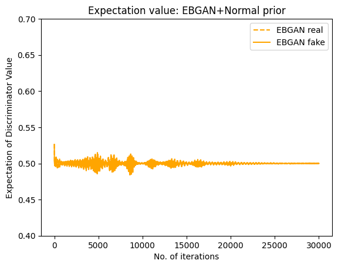

A New Paradigm for Generative Adversarial Networks based on Randomized Decision Rules
===============

The code includes the experiments of the Empirical Bayesian GAN(EBGAN) by Sehwan Kim, Qifan Song, and Faming Liang. We propose to train the GAN by an empirical Bayes-like method by treating the discriminator as a hyper-parameter of the posterior distribution of the generator. Specifically, we simulate generators from its posterior distribution conditioned on the discriminator using a stochastic gradient Markov chain Monte Carlo (MCMC) algorithm, and update the discriminator using stochastic gradient descent along with simulations of the generators. 

## Related Publication

Sehwan Kim, Qifan Song, and Faming Liang (2023+), [A New Paradigm for Generative Adversarial Networks based on Randomized Decision Rules](https://arxiv.org/abs/2306.13641), accepted by *Statistica Sinica*

## Description
EBGAN utilizes multiple generators and one discriminator to tackle the problem of mode collapse. For the synthetic data example, we considered Gaussian distribution with a single mode. The discriminator's value is often employed to assess the attainment of Nash Equilibrium. The plots indicate that both vanilla GAN and EBGAN successfully reach Nash Equilibrium.

    &nbsp;&nbsp;&nbsp;&nbsp; 
     

However, the coverage plots indicate that GAN encounters mode collapse, whereas EBGAN effectively mitigates this issue by incorporating samples from multiple generators.

    

    

For further details, please refer to the notebook `EBGAN_gaussian_Nprior.ipynb`.

## Image generation

    
     

## Clustering

    

